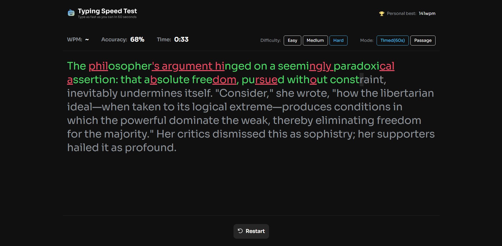

# WPM calculator

WPM calculator is a web app that measures how quickly you can type different types of text.

## Table of contents

- [Overview](#overview)
  - [The project](#the-project)
  - [Screenshot](#screenshot)
  - [Links](#links)
- [My process](#my-process)
  - [Built with](#built-with)
  - [Continued development](#continued-development)
  - [Useful resources](#useful-resources)
- [Author](#author)

## Overview

### The project

Users are able to:

- View the optimal layout depending on their device's screen size
- See hover states for interactive elements
- Choose timed or passage mode
- Filter difficulty
- See their best run
- The best result is stored in local storage, so user's data on how they performed won't be lost 

### Screenshot

### Links

- Solution URL: [Add solution URL here](https://github.com/paliss9001/test-typing-speed)
- Live Site URL: [Add live site URL here](https://paliss9001.github.io/test-typing-speed/)

## My process

### Built with

- Semantic HTML5 markup
- CSS custom properties
- Flexbox
- CSS Grid
- [React](https://reactjs.org/) - JS library
- SASS (SCSS)
- BEM, Adaptive design
- Figma
- Vite

### Continued development

I am planning to implement a feature that keeps track of the letters users fail to correctly type, and, based on data collected, app will prioritize giving texts with a high occurence of those letters.

Furthermore, I want to allows users choose a difficult mode where removing letters won't work, meaning they will have only once change to type letters correctly.

### Useful resources

- [useEffect - React](https://react.dev/reference/react/useEffect) - this page gave me some practical knowledge of how to work with useEffect hook, so I could sync components with Browser API, an extranl system.  

- [Custom hooks](https://react.dev/learn/reusing-logic-with-custom-hooks) - This article helped me a ton to avoid duplicated logic when managing state and write a more robust code.

## Author

- Personal Website - [Ibrohim Baxodirov](https://paliss9001.github.io/ibrohim_baxodirov/)
- Medium - [@ibrohimbahodirov90](https://medium.com/@ibrohimbahodirov90)
- LinkedIn - [Ibrohim Baxodirov](https://www.linkedin.com/in/ibrohim-baxodirov-a142632b1/)
- Email - ibrohimbahodirov90@gmail.com
